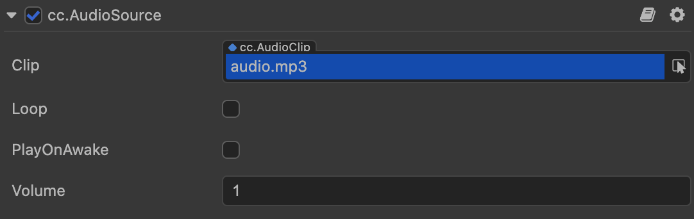

# AudioSource Component

## Properties

|Property          | Description                                                               |
|:--                 | :--                                                                     |
|__Clip__            | The audio resource object to be played                                  |
| __Loop__           | Whether to loop                                                         |
|__PlayOnAwake__     | Whether to play audio automatically after the component is activated    |
|__Volume__          | Audio volume, ranging from 0 to 1                                       |

For more script interfaces for AudioSource, please refer to [AudioSource API](../../../api/en/classes/component_audio.audiosource.html).  
For specific playback controls, please refer to [Audio System Overview](./overview.md).
