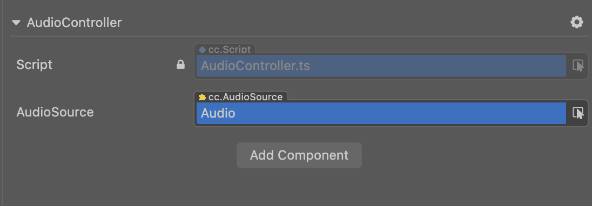

# Overview of sound systems

There are __two__ types of sounds available in the audio system: __sound effects__ and __music__. __Sound effects__ are short bursts of quick sounds that signal the player of the game making progress. A few examples of __sound effects__ are __gun noises__, __bullets firing__, a __character jumping__, __physics contact events__ and many others. __Music__ is longer in length and usually played in a loop. A few examples of __music__ are __background music__, __cut scenes__, __successfully completing a milestone in the game__ and many others.

All audio assets are imported into the editor in the format of __audioClip__ assets.

## Music Playing

1. Create an empty node on the __Node Tree__
2. Select the empty node and click __Add Component -> Components -> AudioSource__ at the bottom of the __Properties__ to add the AudioSource component.
3. Drag the audio resources in __Assets__ to the __Clip__ of the AudioSource component, as follows:

    

4. Then set the other parameter of the AudioSource component as needed, for the details of parameter can refer [Audiosource Component Reference](./audiosource.md).

If you only need to play the audio automatically after the game is loaded, check the __PlayOnAwake__ of the AudioSource component. If you want more flexibility in controlling AudioSource playback, you can get the __AudioSource Component__ in the custom script and then call the appropriate API. As shown below:

```typescript
// AudioController.js
@ccclass("AudioController")
export class AudioController extends Component { 
    
    @property(AudioSource)
    public audioSource: AudioSource = null!;

    play () {
        this.audioSource.play();
    }

    pause () {
        this.audioSource.pause();
    }
}
```

Then add the corresponding custom component to the editor's __Properties__. Selecting the corresponding node and add the custom component by clicking __Add Component-> Custom script -> User Script__ at the bottom of the __Properties__. Then drag and drop the node with the AudioSource component onto __Audio Source__ in the custom component. As shown below:



## Effect Playing

Compared to long music playback, audio effects playback has the following characteristics:
- Short playback time
- A large number of simultaneous playback

For such playback requirements, the AudioSource component provides the `playOneShot` interface to play audio effects. The specific code implementation is as follows:

```typescript
// AudioController.js
@ccclass("AudioController")
export class AudioController extends Component {     

    @property(AudioClip)
    public clip: AudioClip = null!;   

    @property(AudioSource)
    public audioSource: AudioSource = null!;

    playOneShot () {
        this.audioSource.playOneShot(this.clip, 1);
    }
}
```

> __Note__: `playOneShot` is a one-time play operation, there is no way to pause or stop the audio after it is played, and no way to register the `ended` event callback.

## Web Platform Playback Restrictions

Audio playback on the Web platform currently requires compliance with the latest [Audio Play Police](https://www.chromium.org/audio-video/autoplay), and even if the AudioSource component is set to `playOnAwake` it will not start until the first user input is received. An example is as follows:

```typescript
// AudioController.js
@ccclass("AudioController")
export class AudioController extends Component {      

    @property(AudioSource)
    public audioSource: AudioSource = null!;

    start () {
        let btnNode = find('BUTTON_NODE_NAME');
        btnNode!.on('touchstart', this.playAudio, this);
    }
    
    playAudio () {
        this.audioSource.play();
    }
}
```

## Related Links

[Audio Asset](../asset/audio.md)  
[AudioSource Component](./audiosource.md)
